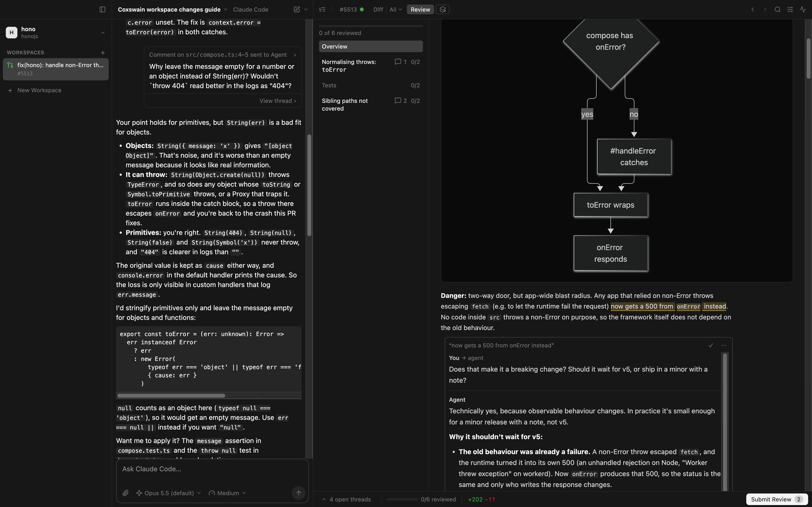

# coxswain

> **cox·swain** /ˈkɒks(ə)n/ _noun_
> The one in the boat who doesn't row. They steer, call the stroke and keep the crew in time.
>
> Your agents are the rowers. You are the coxswain.



coxswain is a local ADE, an agentic development environment, for reviewing and building code with the coding agents
you already run: Claude Code and Codex. Have an agent explain a pull request, leave review comments on it, hand them to
the agent to implement, and review the diff it comes back with, all without leaving the PR.

> [!NOTE]
> coxswain is a proof of concept. Expect rough edges, and expect things to change.

## Motivation

Pull requests are getting huge, and more and more of them are written by AI. Checks and AI review already catch a lot
of what used to take a reviewer's time. What's left for the human is the part that matters most: understanding the
change and reviewing its fine details. GitHub's PR view isn't built for that kind of close reading, especially not on
a large diff.

coxswain leans heavily on the diff review experience of Linear, but runs locally, on your own
checkout, and lets you bring your own AI subscription: the Claude Code or Codex you already pay for and are signed in
to.

## Features

- **Pull requests as workspaces.** Add a GitHub repository, open any of its PRs, and coxswain checks it out in its
  own git worktree. Code stays on your machine.
- **Views: the agent explains the change.** A view is a document the agent writes on the canvas, next to the code:
  markdown sections with tables and mermaid diagrams, and the file diffs and files they're about embedded, threads
  and all. A _guide_ walks the whole diff in reading order: it opens with the shape of the change and how risky it
  is, then goes through the files by theme, with explanations on the tricky lines. Ask for a review, a data model, a
  data flow, questions for the author or a prompt of your own, of a PR, one commit, one agent turn, or code with no
  diff at all. Each view gets a chip in the canvas bar.
- **Threads with the agent.** Comment on lines of a diff, or on a passage of a view. A comment is a note, or a
  question the agent answers in the thread, right between the lines it's about; carry on the conversation there.
  Ask for a review and the agent leaves its findings as threads too.
- **Comments become agent work.** _Send all to agent_ and it implements your notes in the PR's worktree; its changes
  show up in the same diff, next to the PR's own. Or _Copy as prompt_ and paste them into any other agent.
- **Submit Review, summed up for you.** _Submit Review_ lists your open threads, each with a conclusion a small
  model wrote ahead from it: the decision, the thing to do or the question still open. Edit them, then post them to
  GitHub as one review, send them to the agent or copy them as a prompt.
- **GitHub, both ways.** The PR's review threads show between the lines next to yours, and your review goes back as
  replies, resolves and comments on the lines. The PR panel has the description, conversation, checks, reviewers,
  labels and the merge button; a failing check goes to the agent with its log.
- **Every agent turn is a diff.** Each turn that changed the worktree is listed under _Turns_, next to _Commits_, so
  you can review what the agent did one turn at a time. Start a workspace on a new branch, let the agent build, see
  what's not pushed or still uncommitted, then open a draft PR from it.
- **Your agents, with your setup.** Claude Code and Codex run in the agent pane over the
  [Agent Client Protocol](https://agentclientprotocol.com), using your own installs and sign-ins, so your skills and
  custom commands come along: type `/` in the composer. Pick the model and the effort per agent. Guides and reviews
  follow three skills that ship with coxswain (`pr`, `writing-beats` and `code-review`, from
  [mattpocock/skills](https://github.com/mattpocock/skills)).
- **Track what you've reviewed.** Mark file diffs, or a view's whole section, as reviewed; they stay reviewed until
  their contents change, for instance after an agent's edit.
- **Just enough IDE.** Browse the whole file tree, Open Quickly (⌘⇧O), Go to Definition (⌘-click), Find Usages and
  Find (⌘F). Back and Forward (⌥⌘← ⌥⌘→) step through what the canvas showed, scroll kept.
- **Command palette.** ⌘K, then `>` and a few letters, runs any action; without `>` it opens a file.
- **Light and dark mode.** Follows your system's appearance automatically.

## Requirements

- [Node.js](https://nodejs.org) and [pnpm](https://pnpm.io), to run from source
- `git`
- The [GitHub CLI](https://cli.github.com), signed in: `gh auth login`. coxswain borrows its token and never stores
  it.
- [Claude Code](https://claude.com/claude-code) (`claude`) and, optionally, [Codex](https://github.com/openai/codex)
  (`codex`), signed in

coxswain checks for these at startup and tells you how to fix anything missing. It is an Electron app and should run
wherever Electron does, but so far it has only been tested on macOS.

## Getting started

On macOS or Linux, install the latest release with:

```sh
curl -fsSL https://raw.githubusercontent.com/sladkoff/coxswain/main/install.sh | sh
```

It puts `coxswain.app` in `/Applications` (or `~/Applications`) on macOS, and the AppImage at `~/.local/bin/coxswain`
on Linux. Add a version to install that one instead: `… | sh -s -- 0.2.0-rc.1`. Run it again to update.

On Windows, or to download by hand, take the build for your system from
[Releases](https://github.com/sladkoff/coxswain/releases). Builds aren't signed yet: on macOS, a downloaded app needs
right-click → _Open_ the first time (or `xattr -cr coxswain.app`); the install script doesn't.

To run from source:

```sh
git clone https://github.com/sladkoff/coxswain.git
cd coxswain
pnpm install   # also downloads Electron
pnpm dev       # run with hot reload
```

`pnpm start` builds and runs without hot reload, and adds _View › Rebuild and Reload_ (⇧⌘R) for working on coxswain in coxswain; `pnpm dist` packages the app into `dist/`. coxswain keeps its clones and worktrees in `~/coxswain/`, and its
own data in a SQLite database in the app's data folder. It stores only what GitHub and git don't have: your notes, the
agent's answers and views, and which files you've reviewed.

## Docs

| Doc                                  | What it holds                                  |
| ------------------------------------ | ---------------------------------------------- |
| [GOALS.md](docs/GOALS.md)            | What coxswain is for, and what it isn't.       |
| [Glossary](docs/context/coxswain.md) | Every term used in the code, UI and docs.      |
| [UX.md](docs/UX.md)                  | The screen layout and open UX questions.       |
| [ADRs](docs/adr/)                    | Architecture decisions, one file each.         |
| [DEVLOG.md](docs/DEVLOG.md)          | What has been built so far, and the tech debt. |

## Contributing

Pull requests are welcome; open an issue first. AI-assisted contributions are fine. See
[CONTRIBUTING.md](CONTRIBUTING.md).

## License

[MIT](LICENSE) © Leonid Rousseau
